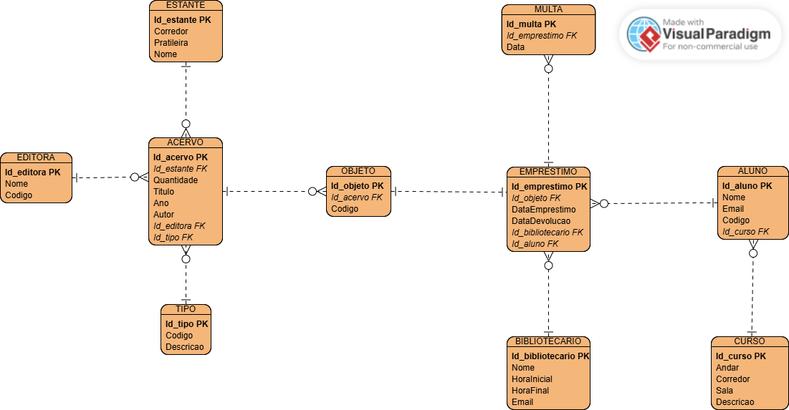

## :book: 1 Introdução 
Este projeto de estudo consiste em construir um sistema bibliotecario, com objetivo de proporcionar o serviço de controle dos emprestimos e do acervo de uma biblioteca.

Para o desenvolvimento deste projeto, fará uso das seguintes ferramentas: 

| Ferramentas  | Descrição |
| :-------------: | :-------------: |
| JAVA 25  | Para o desenvolvimento do Backend  |
| Spring Boot  | Framework utilizado para aplicar o JPA e o Spring Security   |
| React  | Para o desenvolvimento do Frontend  |
| API Rest | Modelo de API adotado |
| MySQL | Banco de dados |


## :office: 2 Estrutura do projeto
Nesta sessão iremos abordar a estrutura do projeto, apresentando atráves dos diagramas 
**UML (Linguagem de Modelagem Unificada)** para desenhar e planejar o sistema. 

### 2.1 Modelo Conceitual 
Para visualizar o modelo, acessar o link [Modelo conceitual](https://app.brmodeloweb.com/publicview/6a831de7b01df802fa94efcb). Neste diagrama representa de forma abstrata e visual os conceitos, as regras do negócio e as informações essenciais do sistema.

### 2.2 Diagrama de entidades
Neste diagrama de entidades mostra como os dados se organizam e se ligam em um sistema ou banco de dados



> [!NOTE]
> Lembrando que as notações com siglas PK é a chave primaria e a FK é a chave estrangeira

> [!IMPORTANT]
> Importante lembrar que a estrutura pode sofrer alterações

## ⚙️ 3 Configurações do projeto
Nesta sessão mostrará as configurações necessárias para execução deste projeto. Na máquina é necessário instalar: 
- JAVA 25
- Node.js
- MySQL

### 3.1 Clonando o projeto
1. Entrar na página do [Repositório](https://github.com/ana-maia-ribeiro/Sistema-Bibliotec-rio-).
2. Clicar no botão verde **Code**.
3. Selecionar HTTPS ou SSH.
4. Copiar a URL.
5. Abrir o Terminal ou Git Bash.
6. Executar o comando abaixo:
    ```
    git clone [URL]
    ```
### 3.2 Instalação do JDK
1. Acessar o link [Dowload JDK](https://www.azul.com/downloads/)
2. Abaixar a opção JAVA 25 LTS
> [!NOTE]
> Quando a versão recebe a notação LTS (Long-Term Support), significa que a versão recebe atualizações de segurança e correções de erros por muito mais tempo que as edições normais.

### 3.3 Instalação do Node.js
1. Acessar o link [Dowload Node.js](https://nodejs.org/en/download)
2. Clicar no botão **Windowns Installer(.msi)**

> [!TIP]
> Caso utile a IDE VsCode, recomendamos a extensão **Simple React Snippets** para utilização do React.

## :pencil: 4 ChekList das atividades
Nesta sessão vai apresentar a lista das atividades a serem realizadas para a construção do projeto.
- [ ] Desenvolvimento do backend
- [ ] Conexão com Banco de dados
- [ ] Desenvolvimento da API
- [ ] Aplicação de segurança
- [ ] Definição do design do sistema
- [ ] Desenvolvimento do Frontend


